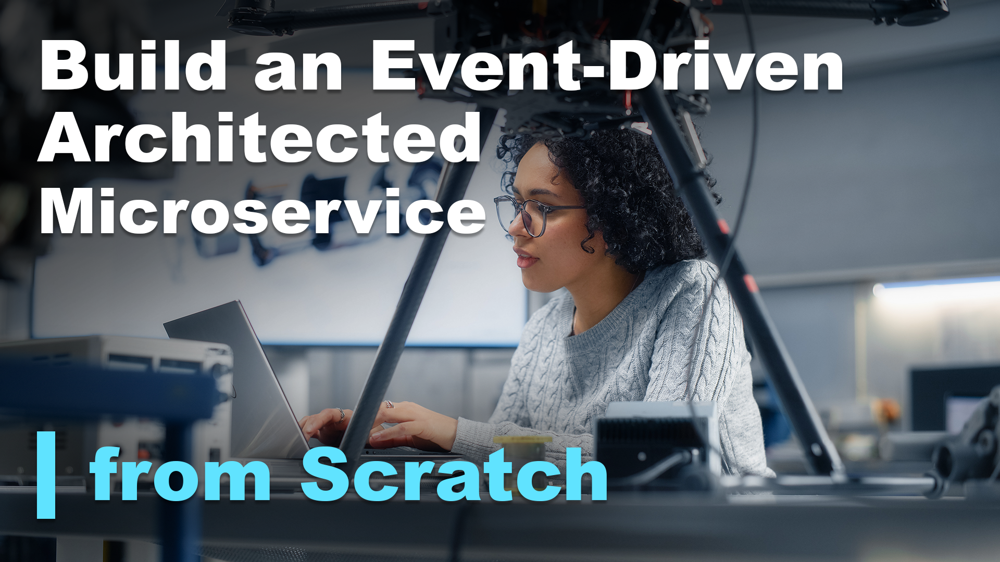

# File New: Build a Event-Driven Architected Microservice from Scratch

## Abstract
Event-driven microservice architectures provide a versatile approach to designing and integrating complex software systems with independent, encapsulated components.  During this session, we will focus on the how by starting with an empty Visual Studio solution and building a complete event-driven architected microservice to solve a real-world problem.  You will see firsthand how to design, develop, and deploy a decoupled, encapsulated, responsive, scalable, and independent solution.  We’ll talk about potential pitfalls, and you will see how to get around them.

## Short Abstract
Starting with an empty Visual Studio solution, during this session we will build an event-driven architected microservice solution to solve a real-world problem.

# Type
* 45/60/75-minute session

## Tags
* .NET
* APIs
* Architecture
* Azure
* Azure Functions
* Best Practices
* C#
* Cosmos DB
* Cloud
* Cloud-Native
* Software Design
* Microservices
* Microsoft
* REST
* Serverless

## Learning Objectives
* Learn the basics of event-driven architectures
* Learn how to transform your complex systems to become event-driven
* See firsthand how to build a event-driven microservice architecture to build highly scalable solutions

## Presentations

| Event | Location | Date | Time | Room | Downloads |
|-------|:--------:|-----:|-----:|-----:|----------:|
| [Nebraska.Code()](https://nebraskacode.amegala.com/) | Lincoln, NE | July 19 - 21, 2023 | TBA | TBA | Available Afterwards |
| [Scenic City Summit](https://sceniccitysummit.com/) | Chattanooga, TN | June 2, 2023 | TBA | TBA | Available Afterwards |
| [Serverless Architecture Conference](https://serverless-architecture.io/london/) | London, UK | April 25, 2023 | 16:00 BST | Albert 3 | [Slides](https://github.com/TaleLearnCode/FileNew-EventDrivenArchitectedMicroservice/blob/main/Presentations/FileNew-EventDrivenArchitectedMicroservice_SACLondon.pdf) |
| [Orlando Code Camp](https://orlandocodecamp.com/) | Sanford, FL | March 25, 2023 | 2:30 PM EDT | 2207 | [Slides](https://github.com/TaleLearnCode/FileNew-EventDrivenArchitectedMicroservice/blob/main/Presentations/FileNew-EventDrivenArchitectedMicroservice-Orlando.pdf) [Demo](https://github.com/TaleLearnCode/FileNew-EventDrivenArchitectedMicroservice/tree/main/Demos/MoveIn) | 
